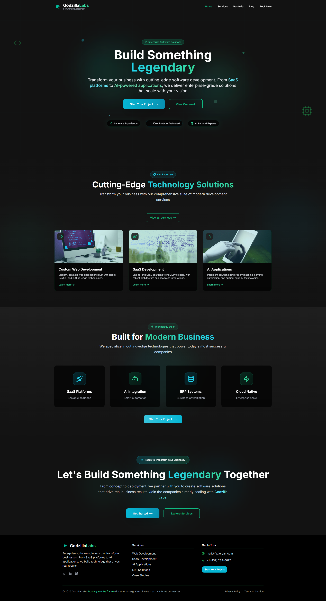

# Godzilla Labs - Enterprise Software Solutions



A modern, responsive website for Godzilla Labs - a cutting-edge software development company specializing in enterprise-grade solutions, SaaS platforms, AI applications, and custom web development.

## 🚀 Live Demo

https://www.godzillalabs.com
Visit the live website to experience the full functionality and modern design.

## 🏗️ Tech Stack Overview


## 📋 Table of Contents

- [Features](#features)
- [Technologies Used](#technologies-used)
- [Project Structure](#project-structure)
- [Installation](#installation)
- [Development](#development)
- [Build](#build)
- [Design System](#design-system)
- [Pages & Components](#pages--components)
- [Contact Information](#contact-information)

## ✨ Features

- **Modern Dark Theme**: Sleek dark design with cyan and emerald green accents
- **Responsive Design**: Fully responsive across all devices and screen sizes
- **Interactive Animations**: Smooth animations and hover effects throughout
- **Glassmorphism Effects**: Modern UI elements with glass-like transparency
- **Gradient Text**: Eye-catching gradient text effects for key elements
- **Contact Forms**: Functional contact and booking forms
- **SEO Optimized**: Proper meta tags and semantic HTML structure
- **Fast Performance**: Optimized with Vite for lightning-fast loading
- **TypeScript**: Full type safety and better development experience

## 🛠 Technologies Used

### Core Framework & Build Tools


- **React 18.3.1** - Modern React with hooks and functional components
- **TypeScript 5.5.3** - Type-safe JavaScript development
- **Vite 5.4.1** - Fast build tool and development server
- **SWC** - Ultra-fast TypeScript/JavaScript compiler

### UI Framework & Styling


- **Tailwind CSS 3.4.11** - Utility-first CSS framework
- **Radix UI** - Headless, accessible UI components
- **Shadcn/ui** - Beautiful, accessible component library
- **Lucide React** - Beautiful & consistent icon toolkit
- **Tailwind Animate** - Animation utilities for Tailwind CSS

### Routing & State Management


- **React Router DOM 6.26.2** - Client-side routing
- **TanStack Query 5.56.2** - Powerful data synchronization for React
- **React Hook Form 7.53.0** - Performant, flexible forms with easy validation
- **Zod 3.23.8** - TypeScript-first schema validation

### Additional Libraries


- **Date-fns 3.6.0** - Modern JavaScript date utility library
- **React Day Picker 8.10.1** - Flexible date picker component
- **Sonner 1.5.0** - Toast notifications
- **Embla Carousel 8.3.0** - Lightweight carousel library
- **Recharts 2.12.7** - Composable charting library
- **Class Variance Authority** - Component variant management
- **CLSX & Tailwind Merge** - Conditional styling utilities

### Development Tools


- **ESLint 9.9.0** - Code linting and quality assurance
- **PostCSS 8.4.47** - CSS post-processing
- **Autoprefixer** - CSS vendor prefixing
- **TypeScript ESLint** - TypeScript-specific linting rules

## 📁 Project Structure

```
godzilla_labs_v2/
├── public/
│   ├── images/                 # Project images and assets
│   │   ├── Godzilla-Labs-SC.png
│   │   ├── gozillalabs_notext.png
│   │   ├── ai_application.jpg
│   │   ├── custom_development.jpg
│   │   ├── saas_development.jpg
│   │   └── erp.jpg
│   ├── favicon.ico
│   └── og-image.png
├── src/
│   ├── components/            # Reusable UI components
│   │   ├── ui/               # Shadcn/ui components
│   │   ├── BlogPost.tsx
│   │   ├── BookingCalendar.tsx
│   │   ├── Footer.tsx
│   │   ├── HeroSection.tsx
│   │   ├── Navbar.tsx
│   │   ├── ServiceCard.tsx
│   │   └── TestimonialCard.tsx
│   ├── pages/                # Page components
│   │   ├── Blog.tsx
│   │   ├── BlogDetail.tsx
│   │   ├── Booking.tsx
│   │   ├── Contact.tsx
│   │   ├── Index.tsx
│   │   ├── NotFound.tsx
│   │   ├── References.tsx
│   │   └── Services.tsx
│   ├── hooks/                # Custom React hooks
│   │   ├── use-mobile.tsx
│   │   └── use-toast.ts
│   ├── lib/                  # Utility functions
│   │   └── utils.ts
│   ├── App.tsx               # Main app component
│   ├── main.tsx             # App entry point
│   ├── index.css            # Global styles
│   └── vite-env.d.ts        # Vite type definitions
├── components.json           # Shadcn/ui configuration
├── tailwind.config.ts       # Tailwind CSS configuration
├── vite.config.ts           # Vite configuration
├── tsconfig.json            # TypeScript configuration
└── package.json             # Project dependencies
```

## 🚀 Installation

1. **Clone the repository**

   ```bash
   git clone <repository-url>
   cd godzilla_labs_v2
   ```

2. **Install dependencies**

   ```bash
   npm install
   ```

3. **Start development server**
   ```bash
   npm run dev
   ```

```

```

4. **Open your browser**
   Navigate to `http://localhost:8080`

## 💻 Development

### Available Scripts

- `npm run dev` - Start development server on port 8080
- `npm run build` - Build for production
- `npm run build:dev` - Build for development
- `npm run preview` - Preview production build
- `npm run lint` - Run ESLint

### Development Server

The development server runs on port 8080 with hot module replacement (HMR) enabled for instant updates during development.

## 🏗 Build

### Production Build

```bash
npm run build
```

The build output will be in the `dist/` directory, optimized for production with:

- Minified JavaScript and CSS
- Tree-shaking for smaller bundle sizes
- Optimized assets and images

### Preview Production Build

```bash
npm run preview
```

This serves the production build locally on port 3030 for testing.

## 🎨 Design System

### Color Palette

- **Primary Background**: `#121212` (Deep black)
- **Secondary Background**: `#1E1E1E` (Lighter black)
- **Accent Colors**:
  - Cyan: `#06B6D4` (Primary accent)
  - Emerald: `#10B981` (Secondary accent)
- **Text Colors**: White and light gray variants

### Typography

- **Primary Font**: Inter (system-ui fallback)
- **Monospace Font**: JetBrains Mono
- **Font Features**: Ligatures and contextual alternates enabled

### Animations

- **Fade In/Out**: Smooth opacity transitions
- **Slide In**: Horizontal slide animations
- **Float**: Subtle floating animations
- **Pulse Glow**: Glowing effects for interactive elements
- **Custom Keyframes**: Tailored animations for specific components

### Components

- **Glassmorphism**: Semi-transparent cards with backdrop blur
- **Gradient Text**: Cyan to emerald gradient text effects
- **Hover Effects**: Scale, translate, and color transitions
- **Responsive Grid**: Flexible layouts for all screen sizes

## 📄 Pages & Components

### Pages

- **Home (`/`)** - Hero section, services overview, and company highlights
- **Services (`/services`)** - Detailed service offerings and capabilities
- **Contact (`/contact`)** - Contact form and company information
- **Booking (`/booking`)** - Project consultation booking (coming soon)
- **Blog (`/blog`)** - Company blog and insights (placeholder)
- **References (`/references`)** - Portfolio and case studies (placeholder)

### Key Components

- **HeroSection** - Animated hero with gradient backgrounds
- **ServiceCard** - Service showcase with hover effects
- **Navbar** - Responsive navigation with mobile menu
- **Footer** - Company information and contact details
- **BookingCalendar** - Interactive booking interface

## 📞 Contact Information

- **Email**: mail@fazleryan.com
- **Phone**: +1 (437) 234-6677
- **Business Hours**: Mon-Fri: 9am-6pm PST | Sat: 10am-4pm PST

## 🏢 About Godzilla Labs

Godzilla Labs is a cutting-edge software development company specializing in:

- **Custom Web Development** - Modern, scalable web applications
- **SaaS Development** - End-to-end SaaS solutions from MVP to scale
- **AI Applications** - Intelligent solutions powered by machine learning
- **ERP Solutions** - Business automation and optimization systems
- **Cloud Migration** - Seamless cloud infrastructure transitions
- **Mobile App Development** - Native and cross-platform mobile solutions

With 6+ years of experience and 100+ successful projects delivered, we transform businesses with technology that drives real results.

---

**Built with ❤️ by Godzilla Labs**

_Enterprise software solutions that transform businesses. From SaaS platforms to AI applications, we build technology that drives real results._
